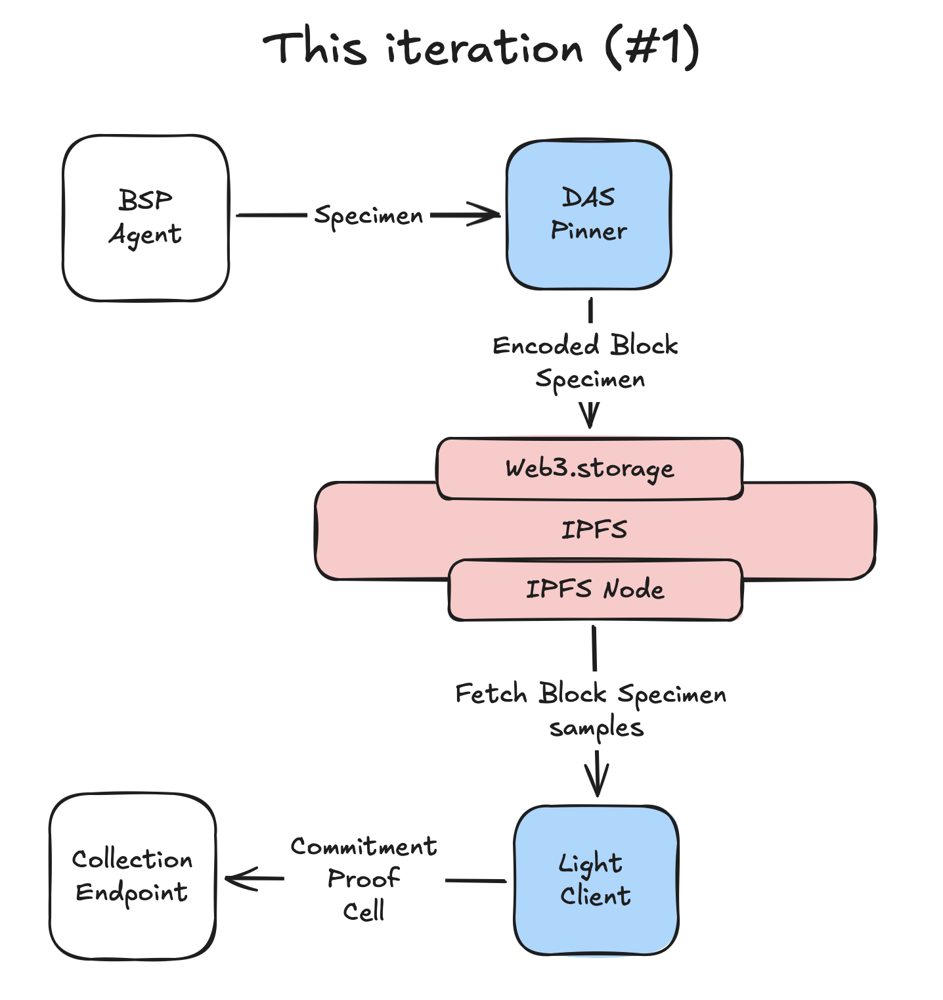

# DAS-Pinner + Light-Client

[](https://github.com/covalenthq/das-ipfs-pinner/actions)

DAS-Pinner is a lightweight IPFS pinner daemon that stores data on the IPFS network and pins the data using **web3.storage**. It is designed to be used with the DAS Light-Client to retrieve data from the IPFS network and verify the data using the DAS protocol.

## Current Iteration



## Table of Contents

- [Running the Service](#running-the-service)
  - [Light-Client](#light-client)
  - [DAS Pinner](#das-pinner)
- [Building from Source](#building-from-source)
- [Configuration](#configuration)
- [Development](#development)
- [License](#license)
- [Contributing](#contributing)

## Running the Service

### Light-Client

- Source: [Guide](LIGHTCLIENT.md#running-light-client-locally)
- Docker version: [Guide](LIGHTCLIENT.md#running-light-client-in-docker)
- macOS: [Guide](INSTALL.md#)
- Linux: TODO

### DAS Pinner

- Run the DAS Pinner service: [DAS-Pinner](PINNER.md#)

## Building from Source

### Prerequisites

- Go 1.22 or later

### Build Commands

1. Clone the repository:

    ```sh
    git clone https://github.com/covalenthq/das-ipfs-pinner
    cd das-ipfs-pinner
    ```

2. Install dependencies:

    ```sh
    make deps
    ```

3. Build binaries:

    ```sh
    make
    ```

This will compile the daemon and CLI tool into the bin directory.

### Clean Up

To clean up the build artifacts, run:

```sh
make clean
```

## Configuration

The project uses environment variables and flags for configuration. For example, you can set `DAEMON_ADDR` to change the address the daemon listens on.

## Development

### Formatting and Linting

To format the code, run:

```sh
make fmt
```

To lint the code, run:

```sh
make vet
make staticcheck
```

### Testing

To run tests, use the following command:

```sh
make test
```

To run tests with a coverage report:

```sh
make test-cover
```

## License

This project is licensed under the MIT License. See the [LICENSE](LICENSE) file for details.


## Contributing

TODO: Add contribution guidelines
